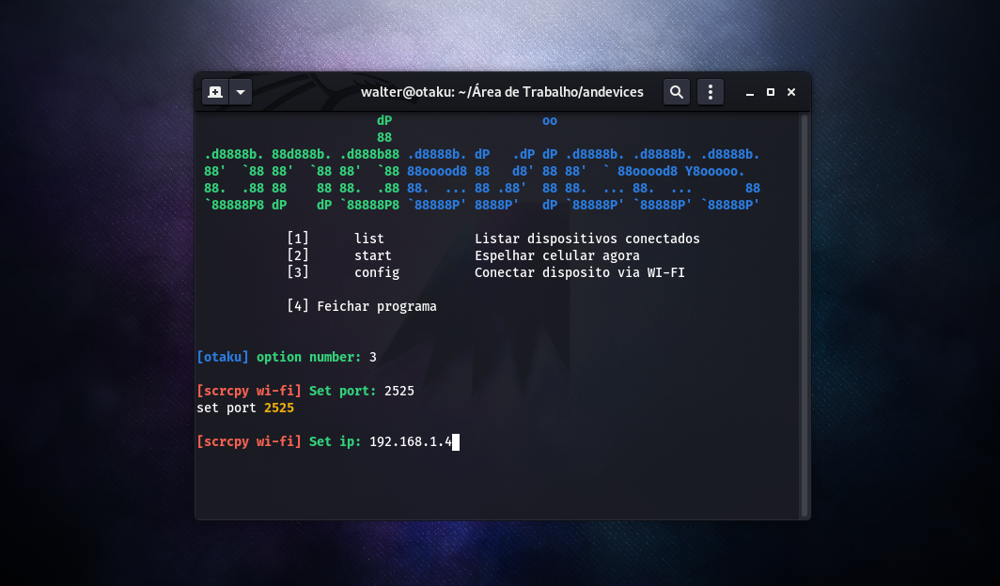

# Andevices

_Script de controle remote de celulares_

[Leia em outro idioma](#translations)

Este aplicativo fornece exibição e controle de dispositivos Android conectados via USB ou TCP/IP . Não requer nenhum acesso root.

